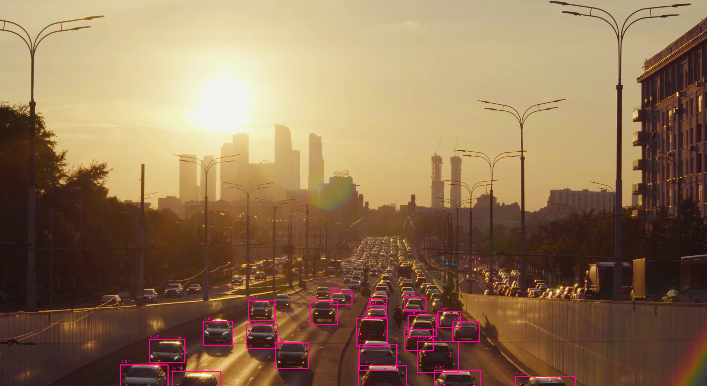

# AI Classifiers

This repository contains Python scripts for vehicle classification and object classification using pre-trained deep learning models. The vehicle classification logic uses the YOLOv3 model for vehicle detection and classification, while the object classification logic uses a pre-trained model for object classification. These scripts can be used to classify vehicles in videos and objects in images, respectively.

This repository contains two directories: one for vehicle classification logic and another for object classification logic, namely `vehicle_classification` and `object_classification`. Each directory contains the necessary files and instructions to run the respective classification logic.

## Vehicle Classification

### Files Included
- `coco.names`: Class names used for vehicle detection.
- `traffic.mp4`: Sample video for vehicle detection.
- `yolov3.cfg`: YOLOv3 model configuration file.
- `yolov3.weights`: Pre-trained YOLOv3 model weights.
- `vehicle_detection.py`: Python script for vehicle detection and classification.

### Getting Started

1. **Clone the Repository**
   ```bash
   git clone https://github.com/hoangsonww/AI-Classification.git
   cd AI-Classification/vehicle_classification
   ```

2. **Download Model Weights**
   Download the pre-trained YOLOv3 model weights (`yolov3.weights`) from the official YOLO website or another trusted source and place it in the `vehicle_classification` directory.

3. **Install Dependencies**
   Install the required Python dependencies.
   ```bash
   pip install -r requirements.txt
   ```

4. **Run Vehicle Detection**
   Replace `<video_path>` in the `vehicle_detection.py` script with the path to your video file (`traffic.mp4` or another video).
   ```bash
   python vehicle_detection.py
   ```
   
The script will then process the video frame by frame, detect vehicles, and classify them based on the detected classes. The output video will be saved as `output.avi` in the `vehicle_classification` directory.

Feel free to change the video path, output video name, and other parameters in the script to suit your needs.

### Output

The output video will display the detected vehicles along with their class labels. The class labels are based on the COCO dataset, which includes various classes such as car, truck, bus, motorcycle, and bicycle.

Example output:



## Object Classification

### Files Included
- `object_classification.py`: Python script for object classification.
- `objects.jpg`: Sample JPEG image for object classification.
- `objects.png`: Sample PNG image for object classification.

### Getting Started

1. **Clone the Repository**
   ```bash
   git clone https://github.com/hoangsonww/AI-Classification.git
   cd AI-Classification/object_classification
   ```

2. **Install Dependencies**
   Install the required Python dependencies.
   ```bash
   pip install -r requirements.txt
   ```

3. **Run Object Classification**
   Replace `<image_path>` in the `object_classification.py` script with the path to your image file (`objects.jpg`, `objects.png`, or another image).
   ```bash
   python object_classification.py
   ```
   
The script will then classify the objects in the image and display the class labels along with the confidence scores.

Feel free to change the image path and other parameters in the script to suit your needs.

### Output

The output will display the class labels of the objects detected in the image along with the confidence scores.

## Contact Information

For any questions or issues, please contact:
- Name: Son Nguyen
- Email: [info@movie-verse.com](mailto:info@movie-verse.com)

---
